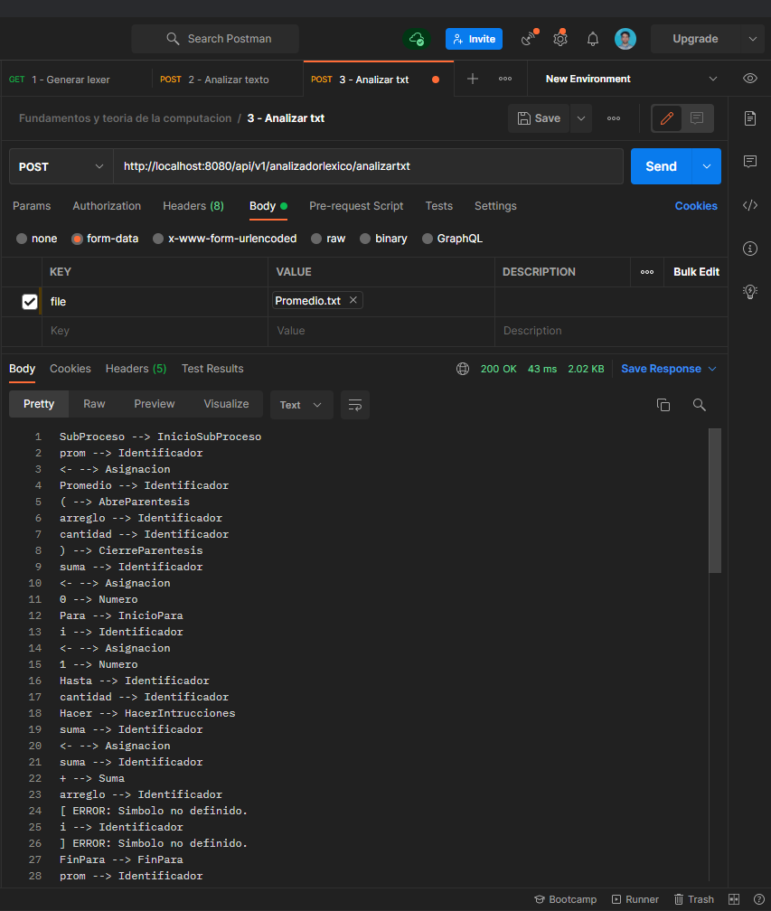

# Analizador léxico
Trabajo final para la materia Fundamentos y teoría de la computación de mi carrera en UNLa.

 [Enunciado del Trabajo Final.](docs\Enunciado\FTC Trabajo Practico Final.pptx) 

Esta Api va a contener el desarrollo de un proyecto el cual será crear un analizador léxico para un conjunto de palabras en el lenguaje de programación Java.

* Vamos a utilizar la herramienta JFlex en cual es un generador de analizadores léxicos para Java.

* Se va a definir mediante expresiones regulares los Tokens que formarán parte de nuestro lenguaje.

* Se va a definir mediante expresiones regulares los Tokens que formarán parte de nuestro lenguaje.

* La herramienta JFlex tiene como entrada las reglas léxicas que están definidas en el Lexer.flex y nos da como salida una clase Flexer el cual tiene los métodos para hacer el análisis léxico.

    * Lexer.flex : Archivo donde definimos todas nuestras reglas y/o lexemas.
    * Lexer :  Clase que se utiliza para analizar texto plano.
    * Tokens : Conjunto de palabras que va a reconocer nuestra clase Lexer.

Si necesitas saber como cree el scaffolding inicial de esta Api entra a aqui:

* Link a Spring Initialzr para ver el [PROYECTO BASE](https://start.spring.io/#!type=maven-project&language=java&platformVersion=2.5.5&packaging=jar&jvmVersion=11&groupId=com.fytc&artifactId=AnalizadorLexico&name=AnalizadorLexico&description=Trabajo%20final%20para%20la%20materia%20Fundamentos%20y%20teor%C3%ADa%20de%20la%20computaci%C3%B3n%20de%20mi%20carrera%20en%20UNLa.%20&packageName=com.fytc.AnalizadorLexico&dependencies=devtools,lombok,web,data-jpa,validation,mysql)

-----------------------------------------------------------

Una vez levantado el contexto de Spring y nuestro servidor vamos a necesitar generar el Lexer que se va a crear en base a las reglas que tenga nuestro Lexer.flex y los Tokens que hayamos definido en nuestra clase Tokens.

* Para testear la Api vamos a hacer uso de [Postman](https://www.postman.com/downloads/).

* Importar [Colección de Postman](docs\Postman collection\Fundamentos y teoria de la computacion.postman_collection.json).

    Postman es una aplicación que nos permite realizar pruebas API. 
    Es un cliente HTTP que nos da la posibilidad de testear 'HTTP requests' 
    a través de una interfaz gráfica de usuario, por medio de la cual 
    obtendremos diferentes tipos de respuesta que posteriormente deberán 
    ser validados.

-----------------------------------------------------------

# 1 - Generar lexer

***Al controlador se le va a pasar la ruta del Lexer.flex y siguiendo un poco la lógica del Patrón MVC le va a pasar la responsabilidad al Servicio generarLexer que lo que va a hacer es tomar esa ruta y crear una clase nueva llamada Lexer generada a través del método generate que nos proporciona la librería JFlex.***

### Endpoint
    GET http://localhost:8080/api/v1/analizadorlexico/generarlexer

### Request
    Lexer generado correctamente.

* Ejemplo de cómo debería quedar el 1er endpoint en Postman.

-----------------------------------------------------------

# 2 - Analizar texto

***Una vez generada la clase Lexer se va a necesitar analizar el texto o el programa PSEINT, el controller va a tomar el texto plano que hayamos escrito en el Payload y va a pasar la responsabilidad al Service el cual va a contener el método analizarTexto que va hacer:***

* 1: Genera un archivo.txt .
* 2: Le escribe lo que nos paso el controller a través del Payload .
* 3: Creamos un Reader para poder leer esté archivo.txt .
* 4: Le pasamos esté Reader a una instancia de la clase Lexer.
* 5: Atrapamos todos los Tokens que hayamos leído en nuestra instancia del Lexer.
* 6: Sumamos todos los resultados a una cadena.
* 7: Una vez que se haya terminado de analizar el archivo.txt y se hayan sumado todos los Tokens y Errores se devuelve una Request con los resultados del análisis.

### Endpoint
    POST http://localhost:8080/api/v1/analizadorlexico/analizartexto

### Ejemplo Payload

    Proceso
    Definir numAIngresar Como Real;
    Definir promedio Como Real;

    promedio = 0;

    Para contador=0 Con Paso 1 Hasta 9 Hacer
        Escribir “Ingrese número: “;
        Leer numAIngresar;

        promedio = promedio + numAIngresar;
    FinMientras

    Escribir “La división es: ", promedio / 10;
    FinProceso

### Request
    Proceso --> InicioProceso
    Definir --> DefinirVariable
    numAIngresar --> Identificador
    Como --> DefinirComoTipo
    Real --> TipoDeDatoReal
    ; --> PuntoYComa
    Definir --> DefinirVariable
    promedio --> Identificador
    Como --> DefinirComoTipo
    Real --> TipoDeDatoReal
    ; --> PuntoYComa
    promedio --> Identificador
    = --> Igual
    0 --> Numero
    ; --> PuntoYComa
    Para --> InicioPara
    contador --> Identificador
    = --> Igual
    0 --> Numero
    Con Paso --> MarcarConPaso
    1 --> Numero
    Hasta --> Identificador
    9 --> Numero
    Hacer --> HacerIntrucciones
    Escribir --> SalidaEscritura
    “ --> Comilla
    Ingrese --> Identificador
    n --> Identificador
    ú ERROR: Simbolo no definido.
    mero --> Identificador
    : --> DosPuntos
    “ --> Comilla
    ; --> PuntoYComa
    Leer --> EntradaLectura
    numAIngresar --> Identificador
    ; --> PuntoYComa
    promedio --> Identificador
    = --> Igual
    promedio --> Identificador
    + --> Suma
    numAIngresar --> Identificador
    ; --> PuntoYComa
    FinMientras --> FinRepeticionMientras
    Escribir --> SalidaEscritura
    “ --> Comilla
    La --> Identificador
    divisi --> Identificador
    ó ERROR: Simbolo no definido.
    n --> Identificador
    es --> Identificador
    : --> DosPuntos
    " --> Comilla
    promedio --> Identificador
    / --> Division
    10 --> Numero
    ; --> PuntoYComa
    FinProceso --> FinProceso
    FIN

* Ejemplo de cómo debería quedar el 2do endpoint en Postman.

-----------------------------------------------------------

# 3 - Analizar archivos .txt

***Para este tercer endpoint podemos analizar archivos .txt locales y analizar los algoritmos PSEINT que contenga el archivo.
Para eso debemos importar un archivo .txt al cuerpo  del endpoint con la Key file para que nuestro controller pueda tomar cualquier archivo .txt para ser analizado correctamente.***

* 1: Toma el archivo .txt .
* 2: Se lo pasa el service .
* 3: Creamos un Reader para poder leer esté archivo.txt .
* 4: Le pasamos esté Reader a una instancia de la clase Lexer.
* 5: Atrapamos todos los Tokens que hayamos leído en nuestra instancia del Lexer.
* 6: Sumamos todos los resultados a una cadena.
* 7: Una vez que se haya terminado de analizar el archivo.txt y se hayan sumado todos los Tokens y Errores se devuelve una Request con los resultados del análisis.

### Endpoint
    POST http://localhost:8080/api/v1/analizadorlexico/analizartxt

### Ejemplo de archivo .txt

    SubProceso prom <- Promedio ( arreglo, cantidad )
        suma <- 0
        Para i<-1 Hasta cantidad Hacer
        suma <- suma + arreglo[i]
        FinPara
        prom <- suma/cantidad
    FinSubProceso

    Proceso
        Dimension datos[100]
        Escribir "Ingrese la cantidad de datos:"
        Leer n
    
        Para i<-1 Hasta n Hacer
            Escribir "Ingrese el dato ",i,":"
            Leer datos[i]
        FinPara
    
        Escribir "El promedio es: ",Promedio(datos,n)
    FinProceso

### Request
    SubProceso --> InicioSubProceso
    prom --> Identificador
    <- --> Asignacion
    Promedio --> Identificador
    ( --> AbreParentesis
    arreglo --> Identificador
    cantidad --> Identificador
    ) --> CierreParentesis
    suma --> Identificador
    <- --> Asignacion
    0 --> Numero
    Para --> InicioPara
    i --> Identificador
    <- --> Asignacion
    1 --> Numero
    Hasta --> Identificador
    cantidad --> Identificador
    Hacer --> HacerIntrucciones
    suma --> Identificador
    <- --> Asignacion
    suma --> Identificador
    + --> Suma
    arreglo --> Identificador
    [ ERROR: Simbolo no definido.
    i --> Identificador
    ] ERROR: Simbolo no definido.
    FinPara --> FinPara
    prom --> Identificador
    <- --> Asignacion
    suma --> Identificador
    / --> Division
    cantidad --> Identificador
    FinSubProceso --> FinSubProceso
    Proceso --> InicioProceso
    Dimension --> DefinirDimension
    datos --> Identificador
    [ ERROR: Simbolo no definido.
    100 --> Numero
    ] ERROR: Simbolo no definido.
    Escribir --> SalidaEscritura
    " --> Comilla
    Ingrese --> Identificador
    la --> Identificador
    cantidad --> Identificador
    de --> Identificador
    datos --> Identificador
    : --> DosPuntos
    " --> Comilla
    Leer --> EntradaLectura
    n --> Identificador
    Para --> InicioPara
    i --> Identificador
    <- --> Asignacion
    1 --> Numero
    Hasta --> Identificador
    n --> Identificador
    Hacer --> HacerIntrucciones
    Escribir --> SalidaEscritura
    " --> Comilla
    Ingrese --> Identificador
    el --> Identificador
    dato --> Identificador
    " --> Comilla
    i --> Identificador
    " --> Comilla
    : --> DosPuntos
    " --> Comilla
    Leer --> EntradaLectura
    datos --> Identificador
    [ ERROR: Simbolo no definido.
    i --> Identificador
    ] ERROR: Simbolo no definido.
    FinPara --> FinPara
    Escribir --> SalidaEscritura
    " --> Comilla
    El --> Identificador
    promedio --> Identificador
    es --> Identificador
    : --> DosPuntos
    " --> Comilla
    Promedio --> Identificador
    ( --> AbreParentesis
    datos --> Identificador
    n --> Identificador
    ) --> CierreParentesis
    FinProceso --> FinProceso
    FIN

* Ejemplo de cómo debería quedar el 3er endpoint en Postman.

----------------
----------------
# Autor
* ####Lopez, Pablo Martin
----------------
# Docente a cargo
* ####Hernán Guillermo Amatriain
----------------
# Asignatura 
* ####Fundamentos y teoría de la computación
----------------
# Universidad - Carrera
* ####Universidad Nacional de Lanús (UNLa) - Licenciatura en sistemas
----------------
# Departamento de Desarrollo Productivo y Tecnológico